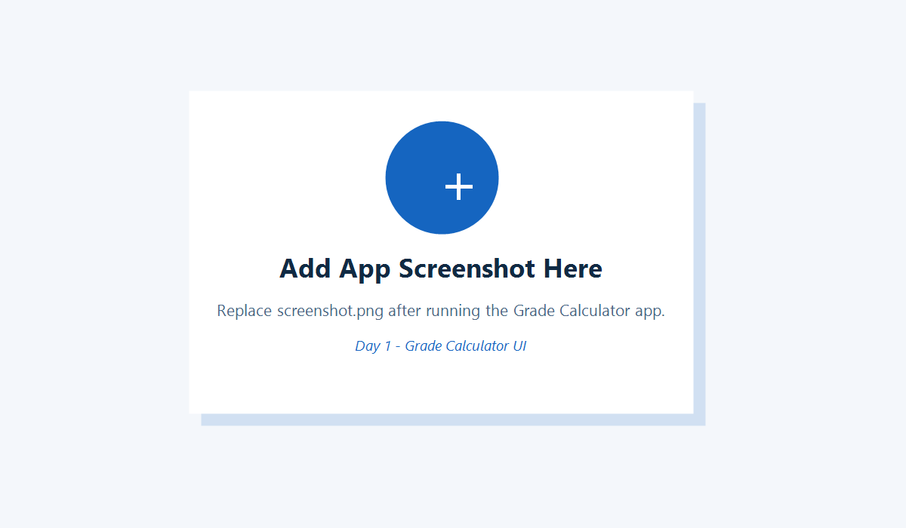

# Day 1 - Grade Calculator UI

This is a simple Flutter app created for Internal Internship Week II - Day 1 - Task 2.

## Features
- Takes three numeric values using TextField
- Validates empty fields
- Validates non-numeric input
- Calculates the average
- Displays the average with two digits after the decimal point
- Shows status: Kalon / Duhet permiresim
- Responsive layout for mobile and desktop

## Student
Emir Helshani

## Screenshot

