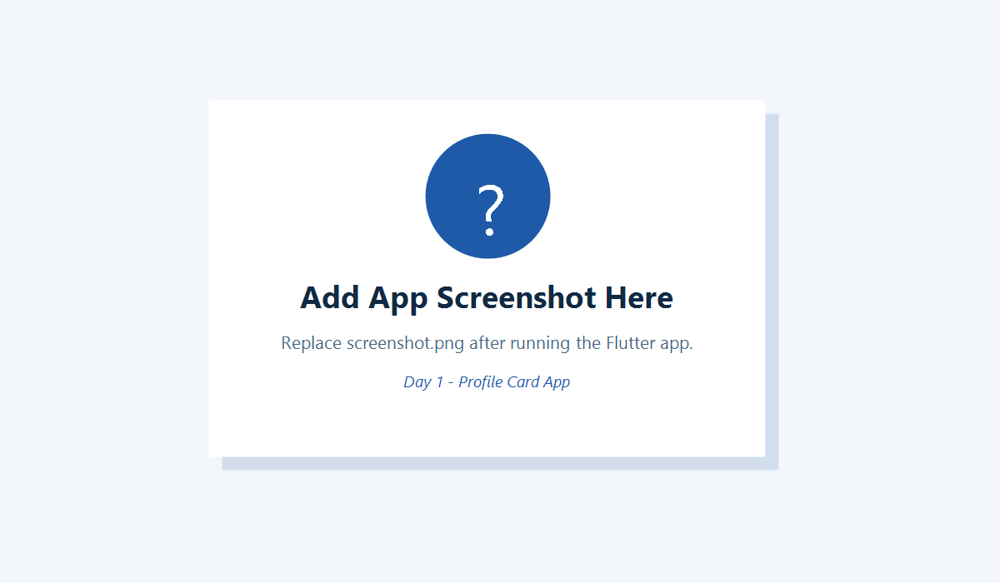

# Day 1 - Profile Card App

Short description:
This is a Flutter Profile Card App created for Internal Internship Week II - Day 1 - Task 1.

Features:
- Uses MaterialApp and Scaffold
- Shows name, role, description, and contact information
- Uses Row, Column, Padding, Container/Card
- Includes a button that updates text and shows a SnackBar
- Responsive layout for mobile and desktop

Student:
Emir Helshani

Screenshot:

