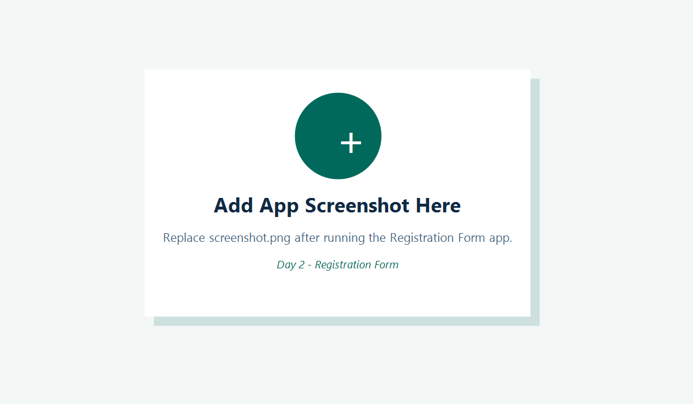

# Day 2 - Registration Form

This is a Flutter Registration Form app created for Internal Internship Week II - Day 2 - Task 2.

## Features
- Name, email, password and role/status fields
- Email validation
- Password length validation
- Error messages without breaking the layout
- Successful submit dialog with user summary
- Responsive layout for mobile and desktop

## Student
Emir Helshani

## Screenshot

