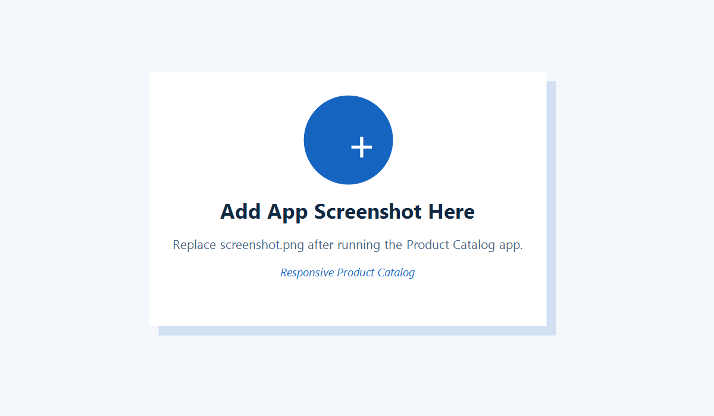

# Day 2 - Responsive Product Catalog

This is a Flutter app created for Internal Internship Week II - Day 2 - Task 1.

## Features

* Product model class
* At least 6 products
* Product cards with name, price, category and icon
* Responsive ListView/GridView layout
* Search filter by product name

## Student

Emir Helshani

## Screenshot

